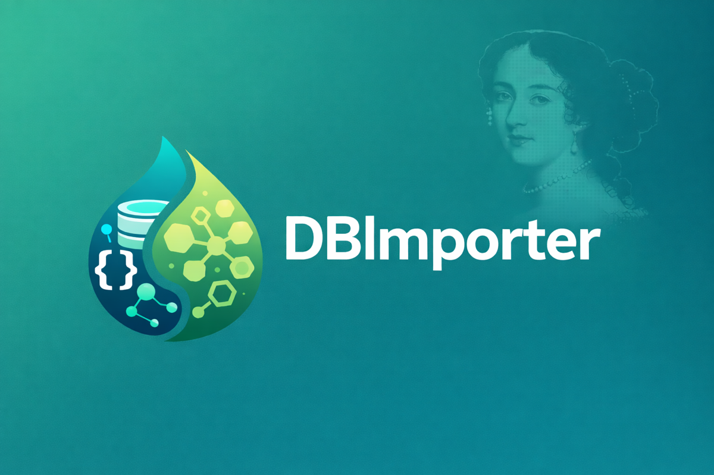
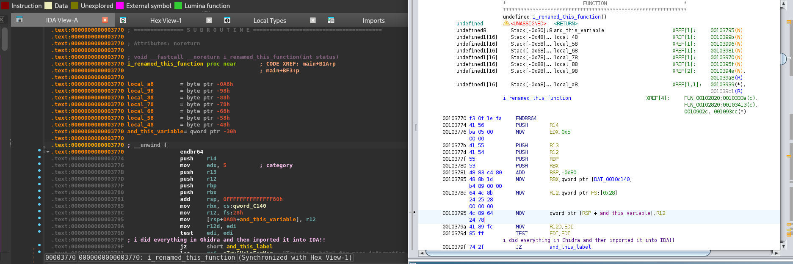

# DBImporter



A plugin for importing various reverse engineering database formats into IDA

This project aims to create a format rich in information that can be used to import data from other reverse-engineering tools into IDA, or vice-versa
At the moment the tool only supports Ghidra XML conversion, but it also has its own IR format (read on further) which makes it easy to create custom format conversion tools (all you need to do is generate some JSON!)



## Installation

### Using HCLI

The simplest way to install the plugin is to use [HCLI - the HexRays CLI tool](https://hex-rays.com/blog/introducing-hcli):
```bash
hcli plugin install DBImporter
```

### Manual installation

You can also install the plugin manually if you wish; to do so:
Clone this repo:
```bash
git clone https://github.com/HexRaysSA/ida-dbimporter
```
to the IDA plugins directory: `~/.idapro/plugins/` on \*nix systems or `%APPDATA%\Hex-Rays\IDA Pro\plugins` on Windows

## Brief usage description

### How to use the plugin in IDA

Open a binary in IDA, navigate to, and run the plugin (Edit -> Plugins -> DBImporter). It will prompt you for a database file exported from another RE tool. Once selected, the plugin will begin converting the data from the export into its own native format (if it isn't in the native format already), and then importing the converted data into your IDA database itself.

### Use as CLI tool

run `python main.py IN_FILEPATH [-o OUT_FILEPATH]`
this will convert the `IN_FILEPATH` file to a new format and save it to `OUT_FILEPATH` file
This can be used i.e. to batch convert files in a shell script

### Use as python module

You can use the python module in your headless IDA scripts with [IDA Domain](https://ida-domain.docs.hex-rays.com), like so
```python
import ida_domain
import ida_dbimporter

with ida_domain.Database.open(path="/path/to/sample") as db:
    ida_dbimporter.import_file_into_ida("/path/to/json")
```

For a more detailed usage guide see [usage.md](usage.md)

## The IDA DBImporter json schema

This project serves to develop a format for sharing data between reverse engineering tools that is powerful, easy to parse/generate and extensible
In its 0.1 version the format is structured as such:
```json
{
    "version": "0.1",
    "datatypes": {
        "NAME OF DATATYPE": {
            "type": "struct|union|typedef|enum|function"
            ...
        }
        ...
    },
    "names": {
        "SYMBOL EA": "SYMBOL NAME"
        ...
    },
    "bookmarks": {
        "BOOKMARK EA": "DESCRIPTION"
        ...
    },
    "comments": {
        "COMMENT EA": { "contents": "COMMENT CONTENTS", "type":  "pre|post|eol|repeatable" }
        ...
    },
    "functions":  {
        "FUNCTION EA": {
            // optional
            "decl": "FUNCTION TYPE DECLARATION",
            "lvars": [
                // stack variables
                { "name": "STACKVAR NAME", "stack_offset": "STACK OFFSET", "size": "SIZE", "type": "TYPE DELCARATION" },
                // register variables
                {
                    "name": "REGVAR NAME",
                    "reg": "CANONICAL REGISTER NAME",
                    "start_ea": "START OF THE RANGE WHERE THE DEFINITION WILL BE USED",
                    "end_ea": "END OF THE RANGE WHERE THE DEFINITION WILL BE USED",
                    "cmt": "COMMENT"
                },
                ...
            ]
        }
        ...
    }
    "segments": [
        {
            "name": "SEGMENT NAME",
            "start_ea": "START OF SEGMENT",
            "end_ea": "END OF SEGMENT",
            "perms": "r?w?x?"
        }
        ...
    ]
    "typed_data": {
        "EA": "TYPE DECLARATION",
        ...
    }
}
```
All EAs (Effective Addresses) are relative to the base import address. EAs, sizes, enum values and offsets (so all integer values) are encoded as hex strings. All sizes are given in bytes.
An entry in the `datatypes` table can take on multiple forms depending on its type:

```json
// function
"FUNCTION TYPEDEF NAME": {
    "type": "function",
    // either programmatically:
    "rettype": "RETURN_TYPE",
    "args": [
        { "name": "ARGUMENT NAME", "type": "ARGUMENT TYPE" }
        ...
    ]
    // or via text:
    "decl": "FUNCTION DECLARATION"
}

// typedef
"TYPEDEF NAME": {
    "type": "typedef",
    "decl": "TYPE DECLARATION"
}

// struct or union
"STRUCT/UNION NAME": {
    "type": "struct|union",
    // either programmatically:
    // must be ordered from lowest to highest offset
    "members": [
        {
            "name": "MEMBER NAME",
            "type": "TYPE DECLARATION",
            "size": "SIZE",
            // only in structs, in unions the offset is ignored
            "offset": "OFFSET"
        }
        ...
    ]
    // or, via text:
    "decl": "STRUCTURE DECLARATION"
}

"ENUM NAME": {
    "type": "enum",
    "size": "SIZE",
    "entries": {
        "ENUM ENTRY NAME": "ENUM ENTRY VALUE"
    }

}
```

Since the format is in its infancy, we strongly encourage you to leave feedback, especially about any issues that you encounter. Ease of use and accessibility are our priority.

## Dependencies
No dependencies required, the project is entirely self-contained! To use it in headless IDA scripts, you will need [IDA Domain](https://ida-domain.docs.hex-rays.com), though.

## Contributing

Make sure your code is formatted with [black](https://github.com/psf/black) and linted with [flake8](https://github.com/PyCQA/flake8) before contributing

Simply run the tools like so in the project root directory:
```bash
black .
flake8 .
```
\**Note: if you're using a python Virtual ENVironment, you will want to run flake8 with the argument '--exclude NAME_OF_VENV', otherwise it will try to stylecheck venv files which is not helpful :)*
